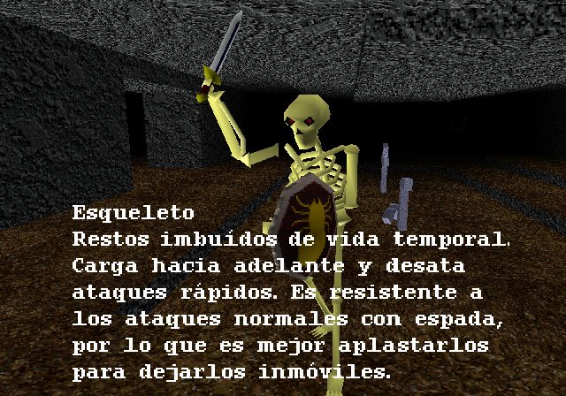
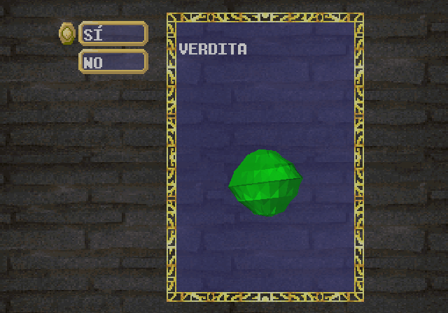
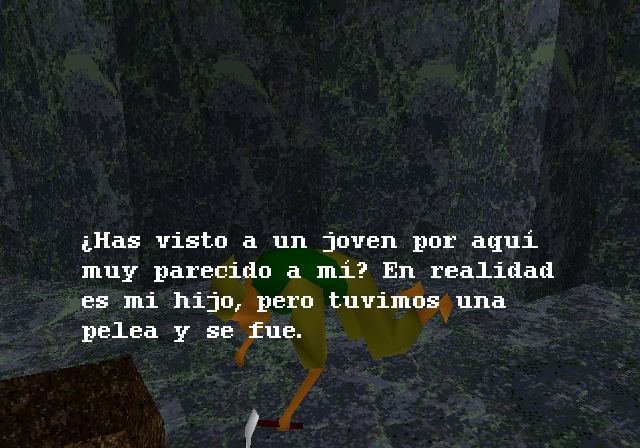
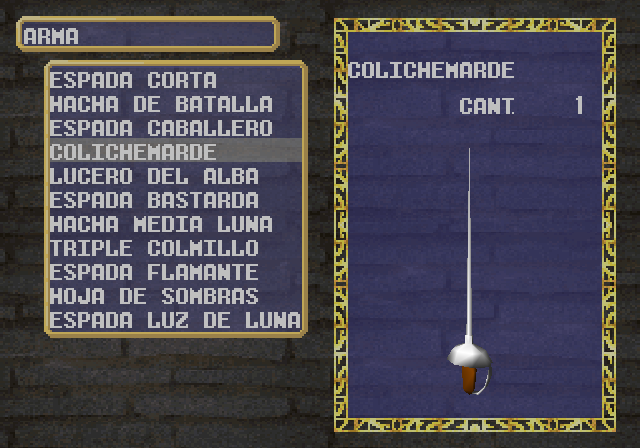
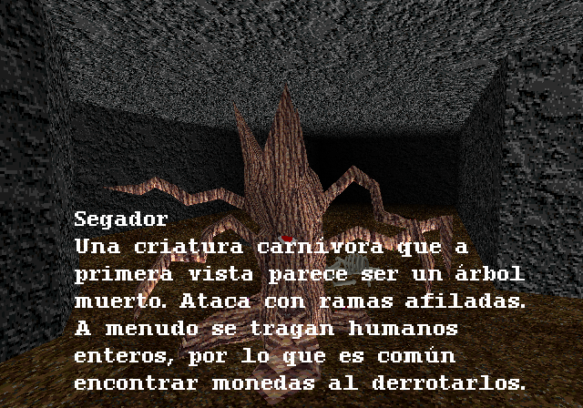

# Kings-Field-Spanish-Translation-Patch
Full Spanish translation patch for King's Field (1994) by FROMSOFTWARE. \
Patch is in xdelta format and should be applied to a .bin file of your game.

Tools: \
[tim2view] (https://github.com/lab313ru/tim2view) \
[TIM Viewer] (https://www.romhacking.net/utilities/486/) \
[Delta Patcher] (https://github.com/marco-calautti/DeltaPatcher)

